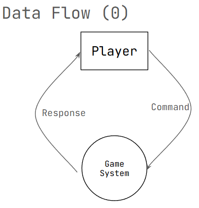
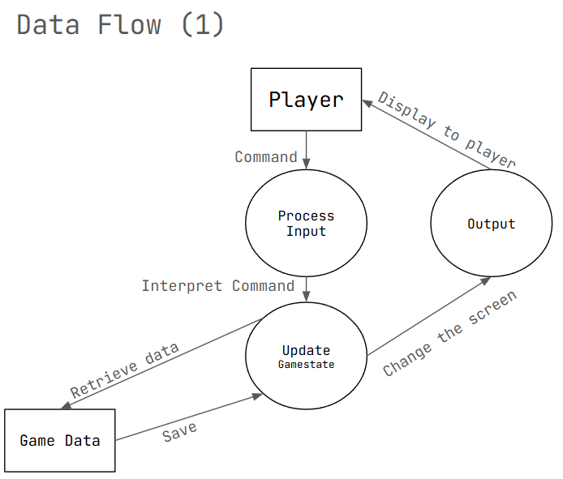
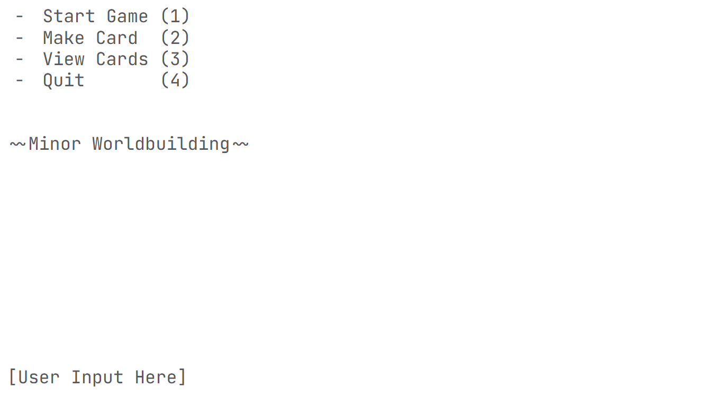
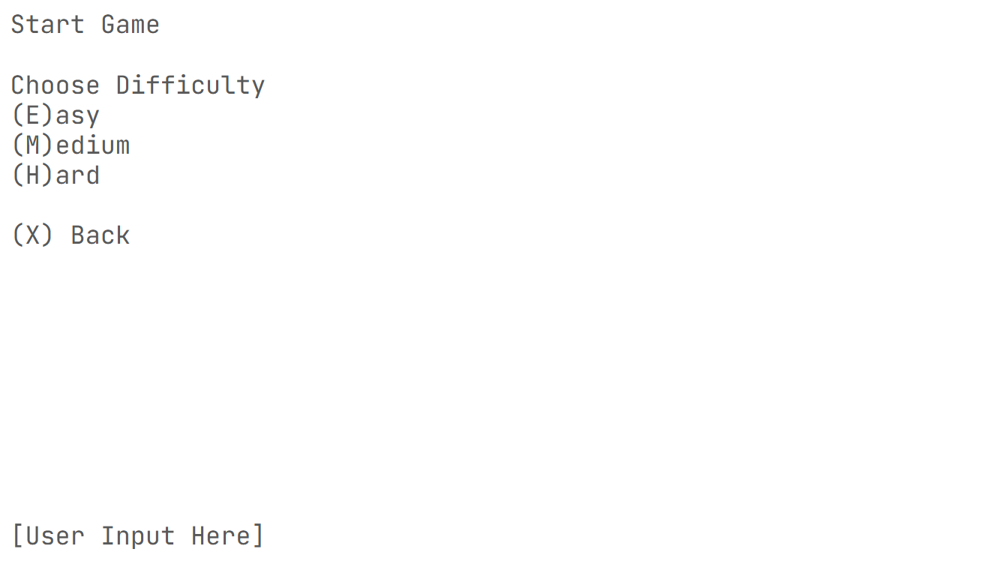
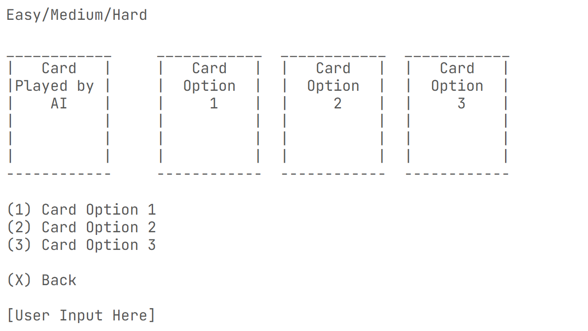
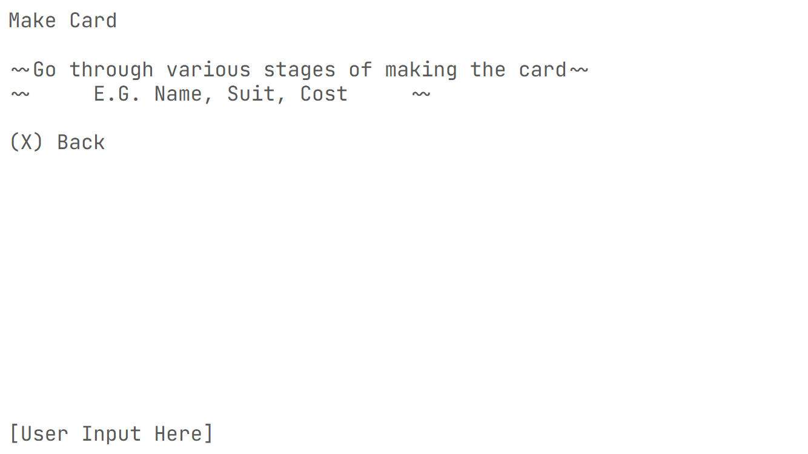
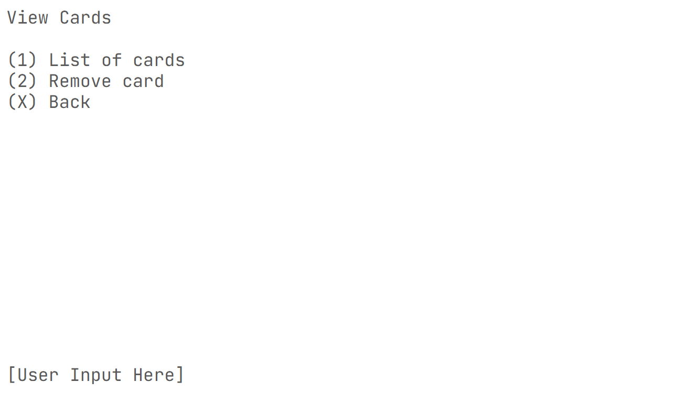
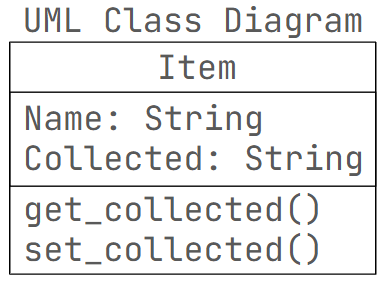

# **Y11 Task 2 2025 - Card Game**

### Alexander Adams

# Sprint 1

## **Requirements Definition**
### Functional
* User can understand the menu
* Menu succesfully reads any user imput
* Game functions properly

### Non-Functional
* System runs quickly
* System always works
* System is easy to use

## **Determining Specifications**
### Functional
* User can end the program, enter any text
* System successfuly redirects from inputs
* Game functions
* System lets users know how to use it
* Minimal errors that are hard to encounter

### Non-Functional
* System is efficient
* Accessable to new users to understand
* Game is fun to play

## **Use Case**
  Actor: User (Player)

Preconditions: None

Main Flow:

* Start game - Allows user to start a game of easy, medium or hard difficulty
* Make a Card - Allows user to make a card and add it to the card pool
* View Cards - Allows user to look at a list of all cards and edit it
* Quit - System ends the program
* Other - System displays error message and allows user to input again

Postconditions: Game starts, Card is added to pool successfully, Pool is changed successfully, Program ends, Program still works

## Design
    Data flow diagram / Story Boards

## Build and Test
    def main():
        print('')
        print('Start Game ~ (1)')
        print('Make Card  ~ (2)')
        print('View Cards ~ (3)')
        print('Quit       ~ (4)')
        print('')
        print('Decend The Dungeon Depths, and Return With Pride')
        print('')
        input1 = input('?')
        if input1 == '1':
            print('')
            print('~Start Game~')
            print('Difficulty')
            print('(E)asy')
            print('(N)ormal')
            print('(H)ard')
            print('')
            print('(X) Back')
            print('')
            input2 = input('?').lower()
            if input2 == 'e':
                print('Easy Selected') # For Sprint 2
            elif input2 == 'n':
                print('Normal Selected') # For Sprint 2
            elif input2 == 'h':
                print('Hard Selected') # For Sprint 2
            elif input2 == 'x':
                main()
            else:
                print('Try again')
        elif input1 == '2':
            print('Card Maker')
        elif input1 == '3':
            print('View Cards')
        elif input1 != '4':
            print ('Error, Try Again')
            main()
        else:
            print('')
    main()

## Review
    System meets all requirements set for sprint 1
    Performance is high, as it is currently a simple program and doesn't use many resources
    Code needs to be organised better for future sprints, and I need to catch up
    Should bring in function use for sprint two to make it easier to program

# Sprint 2

## Build and Test
    class Card:
        def __init__(self, name, suit, cost):
            self.name = name
            self.suit = suit
            self.cost = cost

## Review
    Need to restructure project for sake of making a functioinal one in the alloted time

# Sprint 3

## Design

## Build and Test
    #from Item_Class import * # Imports item class
    #from First_Area import * # Imports the first areas of the game
    import Item_Class as IC
    import First_Area as FA
    import Second_Area as SA

    #This paragraph is a list of various 'items' for the game
    lantern = IC.Item('lantern', 'false')
    has_been_start = IC.Item('started', 'false')     # Use of item class to store value of whether or not the player has been to the 'wake_up' area
    first_entered = IC.Item('entered', 'false')    # Has the player entered the mansion
    knife = IC.Item('knife', 'false')
    noise = 0                                       # Noise mechanic in the second area

    # Temporarily putting 'start_area' as a comment for easy testing of the second area

    #FA.start_area()   # Starts the game 
    #print('\n')
    SA.main_int() # Runs the second area, will change back to 'enter_mansion'

## Review

System could use optimisations in formatting, but should be sufficient in other requirements set.

Program reads inputs successfully, however I can't remove options from scenes, so I have settled for hiding the option, such that a player wouldn't know they can collect an item multiple times.

Code is difficult to read, but I am able to parse it well enough for the development of the program. Structure could use work as I don't have a direct system for organisation of code, leading to disorganised code blocks.

Improvment of code structure would be good, however I think I will just work on finishing the second area first.